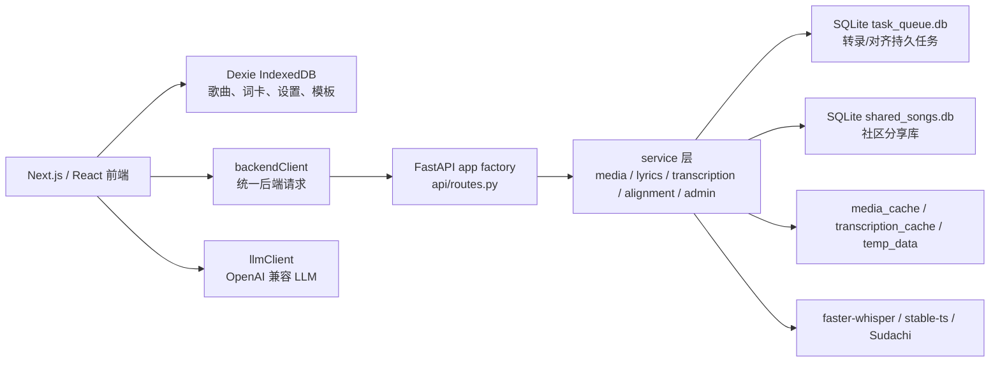

# J-Melo

J-Melo 是一个面向“自托管小圈子”的日语歌学习工具：前端负责本地歌曲库、歌词编辑、词卡和复习；后端负责媒体抓取、语音转录、歌词对齐、社区分享与管理。它不假设大型公开平台，也不引入 Redis、Celery 或账号体系，核心目标是轻量、可迁移、可自管。

- 官网：[j-melo.flashlizard.top](https://j-melo.flashlizard.top/)
- 演示视频：[Bilibili BV16AADzPExn](https://www.bilibili.com/video/BV16AADzPExn/)

## 功能概览

- 歌曲导入：通过 URL 抓取 YouTube、Bilibili、网易云等 yt-dlp 支持的媒体，并缓存为本地音频。
- 沉浸式播放器：三栏播放器、歌词高亮、移动端滑动视图、注音和翻译显示开关。
- 歌词系统：支持转录生成、PetitLyrics/Utaten 导入、无时间轴歌词导入、AI 校正、AI 翻译、手动编辑和 JSON 编辑。
- 词汇学习：选词生成解释，保存为词卡，按歌曲或全局管理，支持 Anki CSV 导出和 SRS 复习。
- 社区分享：把歌曲、歌词、词卡和封面分享到自托管社区库，其他用户可搜索并导入。
- 管理后台：通过 Bearer token 查看缓存、清理数据、配置缓存策略、管理社区内容。
- 数据迁移：前端 IndexedDB 使用 Dexie 版本迁移；导出 JSON 带 `version`，导入仍兼容旧版无版本数据。

## 技术路线



前端是 Next.js、React、TypeScript、Zustand、Dexie 和 Tailwind。后端是 FastAPI、SQLite、yt-dlp、faster-whisper、stable-ts、SudachiPy。LLM 请求默认从浏览器直连 OpenAI 兼容接口，后端不代理用户的 LLM Key。

## 目录结构

```text
app/                     Next.js 前端
  src/lib/               IndexedDB、backendClient、llmClient、AI JSON 工具
  src/stores/            Zustand 状态
  src/components/        播放器、歌词、词汇、社区、工具面板
  public/config.json     可选的前端部署配置
backend/                 FastAPI 后端
  main.py                app factory、模型加载、startup worker
  api/routes.py          API 路由兼容层
  core/                  配置、模型、通用工具
  services/              业务服务和 SQLite 任务队列
  config.json            可选的后端运行配置
docs/                    中文专题文档
```

## Windows 部署教程

Windows 适合本机学习、局域网共享或小型自托管。下面命令使用 PowerShell；如果要长期公网运行，更推荐参考后面的 Linux systemd + Nginx 部署方式。

### 1. 安装依赖

先安装 Git、Python、Node.js 和 FFmpeg。可以使用安装包，也可以用 winget：

```powershell
winget install --id Git.Git -e
winget install --id Python.Python.3.12 -e
winget install --id OpenJS.NodeJS.LTS -e
winget install --id Gyan.FFmpeg -e
```

安装后重新打开 PowerShell，确认命令可用：

```powershell
git --version
python --version
node --version
npm --version
ffmpeg -version
```

### 2. 拉取代码

```powershell
git clone https://github.com/FlashLizard/J-Melo.git E:\apps\J-Melo
cd E:\apps\J-Melo
```

如果使用自己的 fork，把仓库地址替换为自己的远程仓库即可。

### 3. 部署后端

第一次部署：

```powershell
cd backend
python -m venv venv
.\venv\Scripts\activate
python -m pip install --upgrade pip
pip install -r requirements.txt
Copy-Item config.json.example config.json
```

编辑 `backend/config.json`，本机使用时至少保留：

```json
{
  "admin_token": "replace-with-a-long-random-token",
  "cors_origins": ["http://localhost:3000", "http://127.0.0.1:3000"],
  "media_command_concurrency": 1
}
```

启动后端：

```powershell
cd E:\apps\J-Melo\backend
.\venv\Scripts\activate
uvicorn main:app --host 127.0.0.1 --port 8000
```

开发调试时可以改用：

```powershell
uvicorn main:app --reload --host 127.0.0.1 --port 8000
```

### 4. 部署前端

第一次部署：

```powershell
cd app
npm ci
Copy-Item public\config.json.example public\config.json
```

编辑 `app/public/config.json`：

```json
{
  "backendUrl": "http://127.0.0.1:8000"
}
```

生产模式构建并启动：

```powershell
cd E:\apps\J-Melo\app
npm run build
npm run start -- --hostname 127.0.0.1 --port 3000
```

开发调试时可以改用：

```powershell
npm run dev
```

打开 `http://localhost:3000`。如果后端不在 `http://127.0.0.1:8000`，请修改 `app/public/config.json` 或前端设置页里的后端地址。

### 5. Windows 后台常驻

最简单的方式是保留两个 PowerShell 窗口分别运行后端和前端。如果需要开机自启或无人值守，可以把下面两条命令交给 NSSM、任务计划程序、PM2 或其他进程管理器：

```powershell
cd E:\apps\J-Melo\backend; .\venv\Scripts\activate; uvicorn main:app --host 127.0.0.1 --port 8000
cd E:\apps\J-Melo\app; npm run start -- --hostname 127.0.0.1 --port 3000
```

公网访问时请在反向代理或网关上启用 HTTPS，并把 `backend/config.json` 的 `cors_origins` 改成真实前端域名。

## 后端配置

后端会读取 `backend/config.json`，缺失字段自动使用默认值。路径字段统一相对 `backend/` 解析，避免因为启动目录不同而写到错误位置。

常用配置：

```json
{
  "admin_token": "your-secret-token-here",
  "cors_origins": ["http://localhost:3000"],
  "media_cache_dir": "media_cache",
  "transcription_cache_dir": "transcription_cache",
  "community_db_path": "shared_songs.db",
  "task_db_path": "task_queue.db",
  "transcription_model": "medium",
  "transcription_compute_type": "int8",
  "alignment_model": "base",
  "load_transcription_model": true,
  "load_alignment_model": true,
  "task_worker_enabled": true,
  "max_upload_mb": 50,
  "media_command_concurrency": 1,
  "media_command_queue_timeout_seconds": 30,
  "image_proxy_concurrency": 8,
  "yt_dlp_cookies_file": null,
  "yt_dlp_force_ipv4": true,
  "yt_dlp_js_runtimes": null,
  "yt_dlp_extractor_args": [],
  "yt_dlp_extra_args": []
}
```

公网部署时建议把 `cors_origins` 写成明确域名；如果需要管理后台，请务必设置 `admin_token`。
`media_command_concurrency` 控制 yt-dlp 抓取、下载和搜索子进程并发数，默认 1，适合小型服务器并可避免文件描述符耗尽；媒体抓取结果会写入 `media_cache_index.db`，同一 URL 后续导入会直接复用缓存文件。
`image_proxy_concurrency` 控制社区封面等外部图片代理并发，避免 Explore 页面一次性打开大量外部连接。
YouTube 在 VPS 或代理出口上经常会因地区、登录态、PO Token、JS challenge 或 yt-dlp 版本过旧返回 `Video unavailable`。建议保持 `yt_dlp_force_ipv4` 开启；如果浏览器能看但后端不能抓，优先升级 yt-dlp，然后配置 `yt_dlp_cookies_file`、`yt_dlp_js_runtimes`、`yt_dlp_extractor_args` 或 `yt_dlp_extra_args`。这些字段也可以在后台管理页保存。
Bilibili 有时会对非浏览器请求返回 `HTTP Error 412: Precondition Failed`。J-Melo 会对 Bilibili URL 自动附加浏览器风格的 `Referer`、`Origin` 和 `User-Agent` 头；如果仍失败，优先升级 yt-dlp，并检查代理出口地区或配置登录 cookies。
测试或 CI 可以设置环境变量 `J_MELO_SKIP_MODELS=1` 暂时跳过转录和对齐模型加载；如需隔离真实配置，可用 `J_MELO_CONFIG_FILE` 指向临时配置文件。

## Linux 部署教程

Linux 是推荐的生产部署方式。下面以 Ubuntu/Debian、前后端同一台服务器、systemd 后台守护、Nginx 反向代理为例。示例域名请替换为自己的域名，例如前端 `https://j-melo.example.com`、后端 `https://j-melo-api.example.com`。

### 1. 安装系统依赖

```bash
sudo apt update
sudo apt install -y git curl nginx ffmpeg python3 python3-venv python3-pip build-essential

# Node.js 需要 20 或更高版本；如果系统源版本过旧，可使用 NodeSource 或 nvm。
curl -fsSL https://deb.nodesource.com/setup_20.x | sudo -E bash -
sudo apt install -y nodejs
node -v
npm -v
```

### 2. 拉取代码

```bash
sudo mkdir -p /opt/J-Melo
sudo chown -R "$USER:$USER" /opt/J-Melo
git clone https://github.com/FlashLizard/J-Melo.git /opt/J-Melo
cd /opt/J-Melo
```

如果是私有部署或 fork，也可以把仓库地址替换为自己的远程仓库。
如果准备使用专门的服务用户运行 J-Melo，请在后续命令中把文件属主和 systemd 的 `User=` 改成同一个用户，避免服务启动后无法写入配置、SQLite 和缓存目录。

### 3. 部署后端

```bash
cd /opt/J-Melo/backend
python3 -m venv venv
source venv/bin/activate
pip install --upgrade pip
pip install -r requirements.txt
cp config.json.example config.json

# 先验证 Python 能在 backend 目录导入 main.py；这一步不加载模型。
J_MELO_SKIP_MODELS=1 python -c "import main; print('backend import ok')"
```

编辑 `backend/config.json`，至少修改下面几项：

```json
{
  "admin_token": "replace-with-a-long-random-token",
  "cors_origins": ["https://j-melo.example.com"],
  "load_transcription_model": true,
  "load_alignment_model": true,
  "media_command_concurrency": 1,
  "yt_dlp_force_ipv4": true
}
```

小内存服务器可以先把 `load_transcription_model` 和 `load_alignment_model` 设为 `false`，确认媒体导入、歌词导入和社区功能正常后再开启模型。

创建运行时目录，并确保服务用户可写：

```bash
mkdir -p /opt/J-Melo/.runtime /opt/J-Melo/backend/media_cache /opt/J-Melo/backend/temp_data /opt/J-Melo/backend/transcription_cache
sudo chown -R YOUR_LINUX_USER:YOUR_LINUX_USER /opt/J-Melo
```

这里和下面 systemd 文件中的 `YOUR_LINUX_USER` 都要替换为实际 Linux 用户；如果你直接使用当前用户部署，可以用 `whoami` 查看用户名。

创建 systemd 服务：

```bash
sudo tee /etc/systemd/system/j-melo-backend.service >/dev/null <<'EOF'
[Unit]
Description=J-Melo backend
After=network-online.target
Wants=network-online.target

[Service]
Type=simple
User=YOUR_LINUX_USER
WorkingDirectory=/opt/J-Melo/backend
Environment=PATH=/opt/J-Melo/backend/venv/bin:/usr/local/sbin:/usr/local/bin:/usr/sbin:/usr/bin:/bin
Environment=HOME=/opt/J-Melo/.runtime
Environment=XDG_CACHE_HOME=/opt/J-Melo/.runtime/.cache
Environment=HF_HOME=/opt/J-Melo/.runtime/.cache/huggingface
Environment=TORCH_HOME=/opt/J-Melo/.runtime/.cache/torch
Environment=J_MELO_SKIP_MODELS=0
Environment=PYTHONPATH=/opt/J-Melo/backend
ExecStart=/opt/J-Melo/backend/venv/bin/python -m uvicorn --app-dir /opt/J-Melo/backend main:app --host 127.0.0.1 --port 8000 --proxy-headers
Restart=always
RestartSec=5
LimitNOFILE=65535

[Install]
WantedBy=multi-user.target
EOF
```

把 `YOUR_LINUX_USER` 替换成实际部署用户，然后启动：

```bash
sudo systemctl daemon-reload
sudo systemctl enable --now j-melo-backend
sudo systemctl status j-melo-backend
curl http://127.0.0.1:8000/api/health
```

如果日志出现 `Error loading ASGI app. Could not import module "main"`，通常是 systemd 没在 `backend/` 目录启动，或没有使用后端虚拟环境。按上面的 `ExecStart` 使用 `python -m uvicorn --app-dir /opt/J-Melo/backend main:app` 后，再执行：

```bash
sudo systemctl daemon-reload
sudo systemctl restart j-melo-backend
sudo journalctl -u j-melo-backend -n 100 --no-pager
```

也可以在交互式 shell 中复现真实导入错误：

```bash
cd /opt/J-Melo/backend
source venv/bin/activate
J_MELO_SKIP_MODELS=1 python -c "import main; print('backend import ok')"
```

如果 YouTube 导入经常返回 `yt-dlp info error: Video unavailable`，或 Bilibili 返回 `HTTP Error 412: Precondition Failed`，先在后端虚拟环境中升级 yt-dlp：

```bash
cd /opt/J-Melo/backend
source venv/bin/activate
python -m pip install -U yt-dlp
python -m yt_dlp --version
```

然后按需在 `backend/config.json` 或后台管理页配置：

```json
{
  "proxy": "http://127.0.0.1:7890",
  "yt_dlp_cookies_file": "private/cookies.txt",
  "yt_dlp_force_ipv4": true,
  "yt_dlp_js_runtimes": "node:/usr/bin/node",
  "yt_dlp_extractor_args": [
    "youtube:player_client=web_safari,android"
  ],
  "yt_dlp_extra_args": [
    "--geo-bypass"
  ]
}
```

`yt_dlp_cookies_file` 使用 Netscape cookies.txt 格式，路径可以相对 `backend/`。如果视频只在你的浏览器登录态下可播放，cookies 通常比单纯更换 player client 更有效。修改配置后重启后端服务。

### 4. 部署前端

```bash
cd /opt/J-Melo/app
npm ci
cp public/config.json.example public/config.json
```

编辑 `app/public/config.json`，把后端地址指向公网 HTTPS 后端：

```json
{
  "backendUrl": "https://j-melo-api.example.com"
}
```

构建前端：

```bash
npm run build
```

创建 systemd 服务：

```bash
sudo tee /etc/systemd/system/j-melo-frontend.service >/dev/null <<'EOF'
[Unit]
Description=J-Melo frontend
After=network-online.target
Wants=network-online.target

[Service]
Type=simple
User=YOUR_LINUX_USER
WorkingDirectory=/opt/J-Melo/app
Environment=NODE_ENV=production
ExecStart=/usr/bin/npm run start -- --hostname 127.0.0.1 --port 3000
Restart=always
RestartSec=5

[Install]
WantedBy=multi-user.target
EOF
```

启动前端：

```bash
sudo systemctl daemon-reload
sudo systemctl enable --now j-melo-frontend
sudo systemctl status j-melo-frontend
curl http://127.0.0.1:3000
```

### 5. 配置 Nginx 反向代理

前端站点：

```nginx
server {
    listen 80;
    server_name j-melo.example.com;

    location / {
        proxy_pass http://127.0.0.1:3000;
        proxy_http_version 1.1;
        proxy_set_header Host $host;
        proxy_set_header X-Real-IP $remote_addr;
        proxy_set_header X-Forwarded-For $proxy_add_x_forwarded_for;
        proxy_set_header X-Forwarded-Proto $scheme;
        proxy_set_header Upgrade $http_upgrade;
        proxy_set_header Connection "upgrade";
    }
}
```

后端站点：

```nginx
server {
    listen 80;
    server_name j-melo-api.example.com;

    client_max_body_size 80m;

    location / {
        proxy_pass http://127.0.0.1:8000;
        proxy_http_version 1.1;
        proxy_set_header Host $host;
        proxy_set_header X-Real-IP $remote_addr;
        proxy_set_header X-Forwarded-For $proxy_add_x_forwarded_for;
        proxy_set_header X-Forwarded-Proto $scheme;
        proxy_read_timeout 600s;
        proxy_send_timeout 600s;
    }
}
```

保存到 `/etc/nginx/sites-available/j-melo` 后启用：

```bash
sudo ln -s /etc/nginx/sites-available/j-melo /etc/nginx/sites-enabled/j-melo
sudo nginx -t
sudo systemctl reload nginx
```

生产环境请用 Certbot、云厂商证书或其他方式开启 HTTPS。开启 HTTPS 后，记得同步修改：

- `backend/config.json` 的 `cors_origins`
- `app/public/config.json` 的 `backendUrl`
- Nginx 的 `server_name` 和证书配置

### 6. 更新部署

```bash
cd /opt/J-Melo
git pull --ff-only

cd backend
source venv/bin/activate
pip install -r requirements.txt
python -m py_compile main.py api/routes.py core/config.py core/models.py core/utils.py services/*.py
sudo systemctl restart j-melo-backend

cd ../app
npm ci
npm run build
sudo systemctl restart j-melo-frontend
```

如果更新后前端连不上后端，先检查 `https://你的后端域名/api/health`。如果公网返回 502/504，通常是后端进程或 Nginx upstream 问题；如果 health 正常但浏览器报 CORS，再检查 `cors_origins` 是否包含当前前端域名。

## API 兼容性

保留的主要接口包括：

- `/api/media/*`
- `/api/transcribe` 和 `/api/transcribe/status/{media_id}`
- `/api/lyrics/*`
- `/api/community/*`
- `/api/admin/*`
- `/api/export`、`/api/import`

新增 `/api/tasks/{task_id}` 用于统一查询持久任务，`/api/health` 用于反向代理、容器和保活探针。旧的转录和对齐状态接口仍可使用，会映射到新的 SQLite 任务表。

## 数据与隐私

- 歌曲、歌词、词卡、设置和模板主要保存在浏览器 IndexedDB。
- 后端会保存媒体缓存、转录缓存、社区分享库和任务队列表。
- 分享到社区时，歌曲数据、词卡、分享昵称和可选封面会写入后端 SQLite。
- LLM 功能默认由浏览器直接请求你配置的 OpenAI 兼容接口，请自行确认服务商的数据政策。
- 导出文件包含歌曲元数据、歌词、词卡、设置和模板，不包含音频二进制缓存。

## 测试与检查

```bash
cd app
npm run type-check
npm test -- --runInBand

cd ../backend
python -m py_compile main.py api/routes.py core/config.py core/models.py core/utils.py services/*.py
.\venv\Scripts\python.exe -m pytest
```

后端测试依赖 `pytest`，已写入 `backend/requirements.txt`。

## 专题文档

- [架构总览](docs/architecture.md)
- [前端本地数据](docs/frontend_local_data.md)
- [后端任务队列](docs/backend_task_queue.md)
- [歌词系统](docs/lyrics_system.md)
- [AI 工具](docs/ai_tools.md)
- [社区与后台](docs/community_admin.md)
- [部署与维护](docs/deployment_maintenance.md)

## 迁移说明

从旧版本升级时通常只需要拉取代码、安装新依赖并重启服务。前端 IndexedDB 会自动执行 Dexie 版本迁移；后端 SQLite 表会在启动时自动创建索引和缺失表。旧的导出 JSON 和社区导入数据仍然被导入器接受。

第一次启动新后端时，`task_queue.db` 会自动创建。若服务器重启时有 `processing` 状态任务，启动后会恢复为 `pending`，由默认单 worker 继续串行处理。

## 常见问题

**转录很慢怎么办？**  
转录和对齐属于重任务，默认单 worker 串行执行，避免小机器被并发任务压垮。可以降低 `transcription_model`，或调整 `transcription_compute_type`。

**为什么社区没有账号体系？**  
项目定位是自托管小圈子。删除自己的分享依赖分享昵称，管理员可以用后台 token 强制删除。

**为什么歌词校正/翻译有时失败？**  
LLM 输出可能不是合法 JSON。前端会尝试提取 fenced/raw JSON，并在失败时保留手动编辑和重试入口。

**可以不使用后端吗？**  
可以使用部分本地功能，但 URL 导入、媒体缓存、转录、对齐、社区和后台都需要后端。

**为什么浏览器显示 CORS，但同时是 502 Bad Gateway？**
这通常不是 FastAPI 的 CORS 配置问题，而是反向代理没有连到存活的后端进程。网关自己生成的 502 不会带应用的 CORS 头，所以浏览器会把它显示成 CORS 失败。生产环境应让进程管理器或容器健康检查持续探测 `/api/health`，并在失败时自动重启后端。
