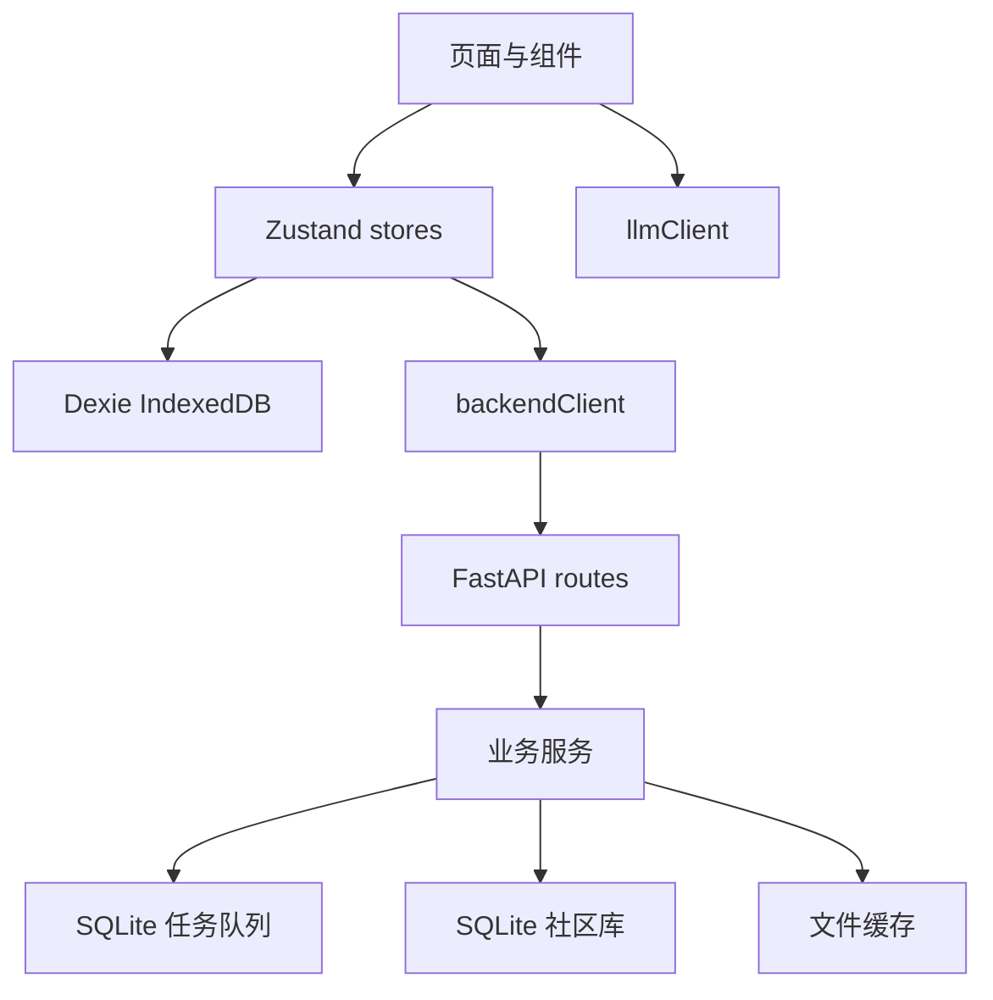

# 架构总览

J-Melo 的架构目标是“小团队可自托管、浏览器本地优先、后端只处理重任务和共享数据”。因此系统没有中心账号体系，也没有 Redis/Celery 这类外部队列依赖。

## 分层

前端按领域拆分为播放器、歌词、词汇、社区、设置和工具面板。后端由 `main.py` 创建应用，`api/routes.py` 保留公开接口，具体逻辑放在 `services/`。

## 后端生命周期

1. 加载 `backend/config.json`，缺失字段用默认配置补齐。
2. 创建 FastAPI app，挂载 `/media_cache` 静态目录。
3. 注册 API 路由。
4. startup 时初始化社区库和任务队列表。
5. 注册转录、对齐任务 handler。
6. 默认启动一个 SQLite worker 串行处理重任务。
7. 启动后台缓存清理协程。

测试和 CI 可设置 `J_MELO_SKIP_MODELS=1` 跳过 faster-whisper 与 stable-ts 模型加载；也可以在配置里关闭 `load_transcription_model` 或 `load_alignment_model`。

## 兼容边界

主要 API 路径保持稳定，前端已有数据结构也保持语义不变。新任务系统通过 `/api/tasks/{task_id}` 暴露统一状态，同时旧接口继续映射：

- `/api/transcribe/status/{media_id}`
- `/api/lyrics/align-status/{task_id}`
- `/api/public/transcription-tasks`
- `/api/admin/transcription-tasks`

## 运行时数据

- `media_cache/`：yt-dlp 下载后的音频缓存。
- `transcription_cache/`：转录 JSON。
- `temp_data/`：导出导入 token、临时音频和对齐中间文件。
- `shared_songs.db`：社区分享 SQLite。
- `task_queue.db`：持久任务队列 SQLite。

路径统一相对 `backend/` 解析。
