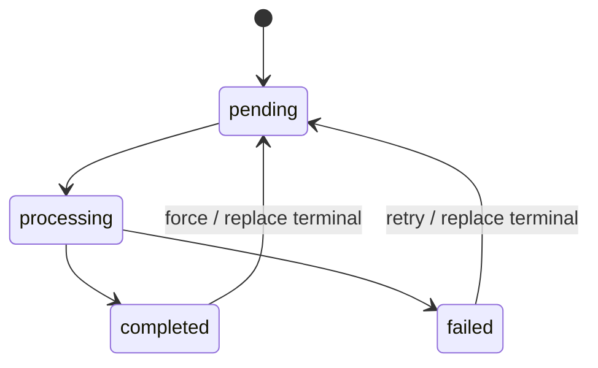

# 后端任务队列

转录和歌词对齐都是长任务。旧版内存任务字典在服务重启后会丢状态，现在统一改为 SQLite 持久任务队列，默认一个 worker 串行执行。

## 表结构

`task_queue.db` 中的 `tasks` 表包含：

- `id`：任务 ID。
- `kind`：任务类型，如 `transcription`、`alignment`。
- `status`：`pending`、`processing`、`completed`、`failed`。
- `task_key`：业务去重键，转录使用媒体 ID。
- `display_name`：前端展示名。
- `payload_json`：任务输入。
- `result_json`：成功结果。
- `error`、`message`：错误和状态说明。
- `created_at`、`started_at`、`completed_at`：ISO 时间戳。

启动时会创建索引：

- `idx_tasks_kind_status`
- `idx_tasks_kind_key`

## 状态流

服务启动时若发现 `processing`，会恢复为 `pending` 并写入 `Recovered after server restart`，避免重启造成永久卡死。

## API

- `POST /api/transcribe`：创建或复用转录任务，返回 `task_id`。
- `GET /api/transcribe/status/{media_id}`：旧接口，优先读转录缓存，再读任务表。
- `POST /api/lyrics/align`：创建对齐任务，返回 `task_id`。
- `GET /api/lyrics/align-status/{task_id}`：旧接口，映射新任务状态。
- `GET /api/tasks/{task_id}`：统一任务查询接口。

## Worker

`main.py` startup 时注册 handler：

- `transcription` 调用 `transcribe_to_cache()`，输出转录缓存 JSON。
- `alignment` 包装旧的 `run_alignment_task()`，把结果写入任务表。

`task_worker_enabled` 为 `false` 时只创建任务，不启动本进程 worker，适合调试或外部托管 worker。
